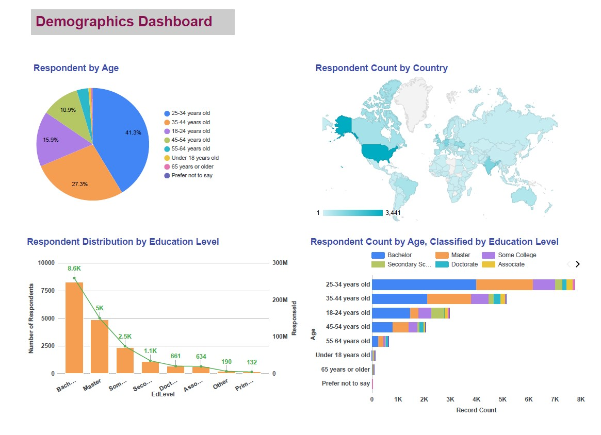
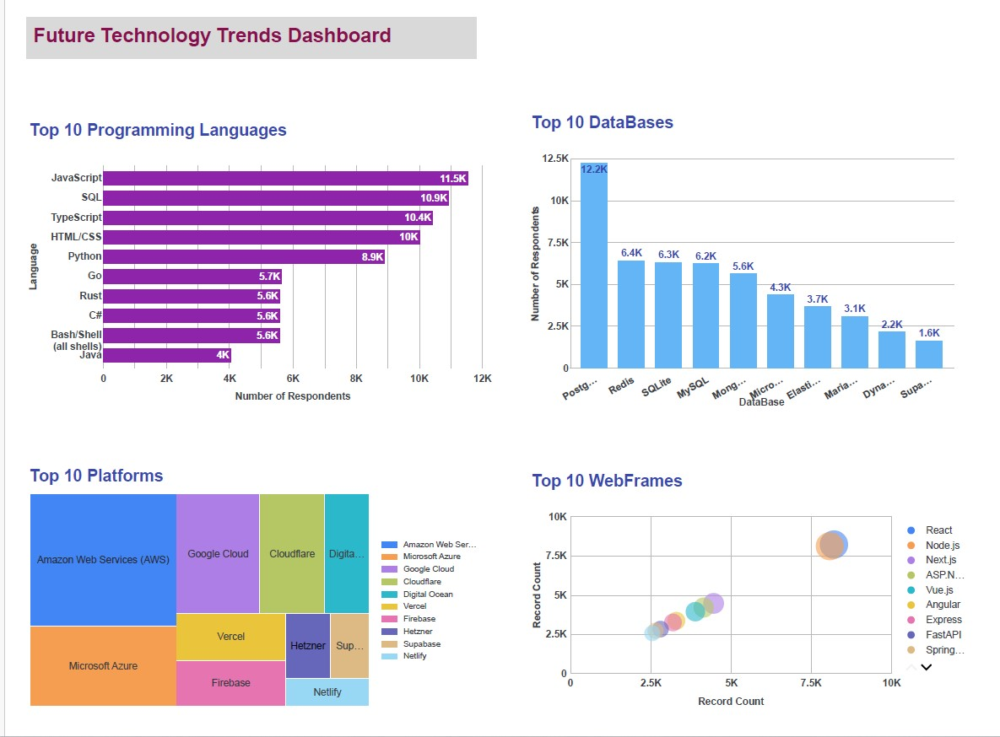

# in-demand-tech-skills-analysis
Analyzing global tech skill demand using real-world data sources to uncover trends in programming languages, databases, and IDEs.

Analysis of Stack Overflow Developer Survey 2024

EXECUTIVE SUMMARY
▪ Analyzed Stack Overflow Developer Survey data to identify current and
future technology trends
▪ Cleaned and transformed raw survey data using Python (Jupyter Notebook)
▪ Built interactive dashboards in Google Looker Studio
▪ Key insights focus on:
▪ Programming languages
▪ Databases
▪ Platforms & web frameworks
▪ Developer demographics
▪ Findings help understand market demand and future skill trends

INTRODUCTION
❑ Stack Overflow Developer Survey is one of the largest global surveys of developers
❑ Provides insights into:
▪ Technologies developers use today
▪ Technologies they want to learn next
▪ Demographic background of respondents
❑ This project aims to:
▪ Explore technology adoption trends
▪ Compare current usage vs future interest
▪ Present insights through interactive dashboards

METHODOLOGY
❑ Data source: Stack Overflow Developer Survey (CSV format)
❑ Tools used:
▪ Python (Pandas, NumPy, Matplotlib) for data cleaning and preprocessing
▪ Google Looker Studio for visualization
❑ Key steps: (Data Preparation)
▪ Removed missing and inconsistent values
▪ Split multi-value fields (e.g., languages, databases)
▪ Normalized data into separate tables
▪ Aggregated counts for visualization
❑ Data Visualization
▪ Created multiple chart types to represent insights:
Bar Charts, Word Cloud, Scatter Bubble Chart, Tree Map, Geo Chart, Pie Char
❑ Dashboards
▪ Built interactive dashboards using Google Looker Studio
▪ Organized dashboards into:
• Current Technology Usage
• Future Technology Trends
• Demographics

## Dashboard Preview

## Dashboard Preview

